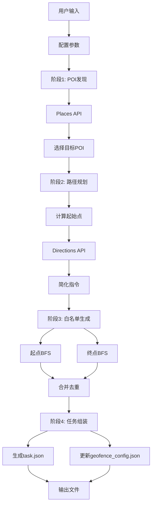

# 自动化测试数据生成系统设计

> **版本**: v1.1  
> **目标**: 自动生成基于 POI 导航的 VLN Benchmark 测试任务

---

## 1. 系统概述

### 1.1 设计目标

自动化生成真实的导航任务，包括：
- ✅ **真实 POI 目标** - 使用 Google Places API 发现实际地点
- ✅ **自然导航指令** - 基于 Directions API，去除街道名
- ✅ **大范围白名单** - 允许 Agent 自由探索和容错
- ✅ **可配置 POI 类型** - 支持餐厅、公交站、地标等

### 1.2 核心特性

| 特性 | 说明 |
|------|------|
| **POI 自动发现** | Places API 自动搜索目标地点 |
| **路径自动规划** | Directions API 生成真实导航路径 |
| **指令简化** | 去除街道名，只保留方向和距离 |
| **大覆盖白名单** | 双向 BFS，覆盖 2x 直线距离 |
| **批量生成** | 支持一次生成多个任务 |

---

## 2. 系统架构



---

## 3. 模块设计

### 3.1 POI Searcher

**职责**: 搜索 POI 并获取坐标

```python
class POISearcher:
    async def search_nearby(
        lat: float, lng: float,
        poi_type: str,           # "restaurant", "transit", "landmark"
        keyword: str = None,     # "McDonald's"
        radius: int = 500        # 搜索半径（米）
    ) -> List[POI]
```

**输入**:
- 搜索中心坐标 (巴塞罗那: 41.4108, 2.1803)
- POI 类型和关键词
- 搜索半径

**输出**:
```python
POI(
    place_id="ChIJxxx",
    name="McDonald's Barcelona",
    lat=41.4120,
    lng=2.1810,
    nearest_pano_id="pano_xyz"  # 通过 Static API 获取
)
```

---

### 3.2 Directions Fetcher

**职责**: 获取导航路径并简化指令

```python
class DirectionsFetcher:
    async def get_route(
        origin_lat: float, origin_lng: float,
        dest_lat: float, dest_lng: float
    ) -> Route
    
    def simplify_instructions(html_instruction: str) -> str
```

**指令简化逻辑**:

| 原始指令 | 简化后 |
|----------|---------|
| `"Turn right onto King Street"` | `"Turn right"` |
| `"Walk northeast on Victoria St for 85m"` | `"Walk northeast for 85m"` |
| `"At the traffic lights, turn left"` | `"At the intersection, turn left"` |

**实现**:
```python
def simplify_instructions(html_instruction):
    # 去除 "on <street>"
    text = re.sub(r' on <b>.*?</b>', '', html_instruction)
    # 去除 "onto <street>"
    text = re.sub(r' onto <b>.*?</b>', '', text)
    # 替换地标为通用术语
    text = re.sub(r'at the <b>.*?</b>', 'at the intersection', text)
    # 去除 HTML 标签
    return re.sub(r'<.*?>', '', text)
```

---

### 3.3 Whitelist Generator

**职责**: 生成大覆盖范围的白名单

```python
class WhitelistGenerator:
    async def generate_from_endpoints(
        spawn_pano_id: str,
        target_pano_id: str,
        coverage_multiplier: float = 2.0  # 覆盖倍数
    ) -> List[str]
```

**策略**: 双向 BFS

```
起始点           目标点
  ●───────────────●
  │╲             ╱│
  │ ╲ BFS     BFS╱ │
  │  ╲         ╱  │  ← coverage_multiplier = 2.0
  │   ╲       ╱   │     (直线距离的2倍)
  │    ╲     ╱    │
  └─────╲───╱─────┘
         ╲ ╱
        合并去重
```

**API 消耗估算**:

| 范围 | 全景点数 | API 调用 | 耗时 |
|------|---------|---------|------|
| 100m | 20-30 | ~25 | 30-40s |
| 200m | 50-80 | ~65 | 1-2分钟 |
| 300m | 100-150 | ~125 | 2-3分钟 |

---

### 3.4 Task Assembler

**职责**: 整合所有模块，输出任务

```python
class TaskAssembler:
    async def generate_navigation_task(
        center_lat: float,
        center_lng: float,
        poi_type: str,
        poi_keyword: str = None,
        task_id: str = None
    ) -> GeneratedTask
```

**完整流程**:

1. **POI 发现** → Places API 搜索
2. **选择目标** → 随机选择一个 POI
3. **计算起点** → 距离目标 100-300m
4. **路径规划** → Directions API
5. **简化指令** → 去除街道名
6. **生成白名单** → 双向 BFS
7. **保存文件** → task.json + geofence_config.json

---

## 4. 数据格式

### 4.1 输出任务格式

```json
{
    "task_id": "nav_mcdonalds_bcn_001",
    "task_type": "navigation_to_poi",
    "geofence": "list_nav_mcdonalds_bcn_001",
    "spawn_point": "pano_abc123",
    "spawn_heading": 45,
    
    "description": "Navigate to the nearby McDonald's. Walk northeast for about 85 meters, then turn right. Continue for 120 meters until you reach an intersection, then turn left. Your destination will be ahead on your right.",
    
    "ground_truth": {
        "target_name": "McDonald's Barcelona",
        "target_pano_id": "pano_xyz789",
        "optimal_path_length": 8,
        "optimal_distance_meters": 350,
        "route_description": "northeast→right→straight→left"
    },
    
    "answer": "",
    "target_pano_ids": ["pano_xyz789"],
    "max_steps": 30,
    "max_time_seconds": 180
}
```

### 4.2 白名单格式

```json
{
    "list_nav_mcdonalds_bcn_001": [
        "pano_abc123",
        "pano_def456",
        "pano_ghi789",
        "... (100-150 个全景点)"
    ]
}
```

---

## 5. 配置文件

### 5.1 POI 配置 (`poi_config.json`)

```json
{
    "poi_categories": {
        "restaurant": {
            "keywords": ["McDonald's", "KFC", "Starbucks", "Subway"],
            "places_type": "restaurant"
        },
        "transit": {
            "keywords": ["bus stop", "subway station"],
            "places_type": ["bus_station", "transit_station"]
        },
        "landmark": {
            "keywords": ["museum", "church", "park"],
            "places_type": ["museum", "church", "park"]
        }
    },
    "generation_defaults": {
        "spawn_distance_min": 100,
        "spawn_distance_max": 300,
        "whitelist_coverage_multiplier": 2.0,
        "search_radius": 500
    }
}
```

---

## 6. CLI 使用

### 6.1 基本用法

```bash
# 生成单个任务
python scripts/generate_tasks.py \
    --center-lat 41.4108 \
    --center-lng 2.1803 \
    --poi-type restaurant \
    --poi-keyword "McDonald's" \
    --task-id nav_mcdonalds_001

# 批量生成
python scripts/generate_tasks.py \
    --center-lat 41.4108 \
    --center-lng 2.1803 \
    --poi-type transit \
    --count 5
```

### 6.2 参数说明

| 参数 | 说明 | 示例 |
|------|------|------|
| `--center-lat` | 搜索中心纬度 | `41.4108` |
| `--center-lng` | 搜索中心经度 | `2.1803` |
| `--poi-type` | POI 类型 | `restaurant`/`transit`/`landmark` |
| `--poi-keyword` | 具体关键词（可选） | `"McDonald's"` |
| `--count` | 批量生成数量 | `5` |
| `--task-id` | 任务ID（可选） | `nav_001` |
| `--output-dir` | 输出目录 | `tasks/` |

---

## 7. API 依赖

### 7.1 Google APIs

| API | 用途 | 计费 |
|-----|------|------|
| **Places API (New)** | 搜索 POI | $17/1000 请求 |
| **Routes API v2** | 获取导航路径 | $5/1000 请求 |
| **Street View Static API** | 获取 pano_id | $7/1000 请求 |
| **Maps JS API** | 获取 links (via Selenium) | 免费（有配额） |
| **Tiles API** | 下载全景图块 | $2/1000 请求 |

### 7.2 环境变量配置

```bash
# .env 文件
GOOGLE_API_KEY=xxx              # 通用 API Key
GOOGLE_PLACES_API_KEY=xxx       # Places API (可选，复用通用Key)
```

---

## 8. 测试区域

### 8.1 默认区域：巴塞罗那 Rambla de Volart

- **坐标**: 41.4108°N, 2.1803°E
- **搜索半径**: 500m
- **可用 POI 类型**: 餐厅、公交站、地标

### 8.2 预期数据量

单个任务生成:
- **1 个 task.json** 文件
- **100-150 个** 白名单全景点
- **~65 次** API 调用（中等范围）
- **1-2 分钟** 生成时间

---

## 9. 实现优先级

1. ✅ **Phase 1**: `poi_searcher.py` - Places API 集成
2. ✅ **Phase 2**: `directions_fetcher.py` - 路径规划 + 指令简化
3. ✅ **Phase 3**: `whitelist_generator.py` - 双向 BFS
4. ✅ **Phase 4**: `task_assembler.py` - 主入口整合
5. ✅ **Phase 5**: `generate_tasks.py` - CLI 工具

---

## 10. API 迁移与故障排除 ⚠️

### 10.1 Google Legacy API 弃用

#### 背景

Google 在 2024 年开始弃用旧版 Maps APIs：

| 旧版 API | 新版 API | 状态 |
|---------|---------|------|
| Places API (Nearby Search) | **Places API (New)** | ❌ 已弃用 |
| Directions API | **Routes API v2** | ❌ 已弃用 |

#### 常见错误

**错误 1: Legacy API 未启用**

```
REQUEST_DENIED - You're calling a legacy API, which is not enabled for your project.
```

- **原因**: 新项目默认不启用旧版 API
- **解决**: 必须迁移到新版 API

**错误 2: New API 未启用**

```
Places API (New) has not been used in project XXXXXX before or it is disabled.
```

- **解决**: 访问 Google Cloud Console 启用，等待 5-10 分钟

---

### 10.2 Places API 迁移

#### 旧版 (已弃用) ❌

```python
url = "https://maps.googleapis.com/maps/api/place/nearbysearch/json"
params = {"location": f"{lat},{lng}", "key": api_key}
response = requests.get(url, params=params)
```

#### 新版 (必需) ✅

```python
url = "https://places.googleapis.com/v1/places:searchNearby"
headers = {
    "X-Goog-Api-Key": api_key,
    "X-Goog-FieldMask": "places.id,places.displayName,places.location"
}
body = {
    "locationRestriction": {
        "circle": {
            "center": {"latitude": lat, "longitude": lng},
            "radius": float(radius)
        }
    },
    "includedTypes": ["restaurant"]
}
response = requests.post(url, headers=headers, json=body)
```

#### 关键差异

| 特性 | 旧版 | 新版 |
|------|------|------|
| 请求方式 | GET | **POST** |
| API Key | URL 参数 | **Header** |
| FieldMask | 不需要 | **必需** |
| 响应 | `results[]` | `places[]` |

---

### 10.3 Routes API 迁移

#### 新版格式 ✅

```python
url = "https://routes.googleapis.com/directions/v2:computeRoutes"
headers = {
    "X-Goog-Api-Key": api_key,
    "X-Goog-FieldMask": "routes.legs.steps.navigationInstruction"
}
body = {
    "origin": {"location": {"latLng": {"latitude": lat, "longitude": lng}}},
    "destination": {"location": {"latLng": {"latitude": lat2, "longitude": lng2}}},
    "travelMode": "WALK"  # 注意大写
}
```

#### ⚠️ 特殊限制

**routingPreference 仅在 DRIVE 模式可用**:

```python
# ❌ 错误
body = {"travelMode": "WALK", "routingPreference": "TRAFFIC_UNAWARE"}

# ✅ 正确
body = {"travelMode": mode}
if mode == "DRIVE":
    body["routingPreference"] = "TRAFFIC_UNAWARE"
```

---

### 10.4 错误速查表

| 错误 | 原因 | 解决 |
|------|------|------|
| `REQUEST_DENIED` | Legacy API 未启用 | 迁移到新 API |
| `has not been used` | 新 API 未启用 | 启用后等 5-10 分钟 |
| `Invalid JSON payload` | 参数格式错误 | 检查 POST body |
| `Unknown name "textQuery"` | 不支持的参数 | searchNearby 不支持此字段 |
| `Routing preference cannot be set` | 参数限制 | 仅 DRIVE 模式 |

---

### 10.5 自动降级策略

代码实现了自动降级机制：

```python
try:
    # 优先使用 Places API (New)
    return await self._search_with_places_api_new(...)
except Exception as e:
    if "not enabled" in str(e):
        # 自动降级到 Text Search
        return await self._search_with_text_search(...)
```

---

## 11. 注意事项

### 11.1 API 使用限制

- **反爬策略**: 请求间隔 1-3 秒
- **错误重试**: 429 错误时指数退避
- **缓存复用**: 已获取的 metadata 不重复请求

### 11.2 数据质量

- **白名单验证**: 确保所有 pano_id 可访问
- **路径可达性**: 验证起点到终点有连通路径
- **Ground Truth 准确性**: Routes API 提供的路径即为最优解

### 11.3 可扩展性

- **新增 POI 类型**: 编辑 `poi_config.json`
- **调整白名单范围**: 修改 `coverage_multiplier`
- **多区域生成**: 提供不同的中心坐标批量运行

---

## 12. Task Generation V2 改进

> **版本**: v2.0  
> **状态**: 设计中

### 12.1 问题背景

当前的 Task 生成流程存在两个主要问题：

**问题 1：Spawn 点可能与 Target 点不连通**

当前流程是先确定 Target 点，然后在指定距离范围内随机选择一个经纬度，再获取该位置最近的全景图作为 Spawn 点。这种方式无法保证 Spawn 和 Target 之间存在全景图连接路径。

**问题 2：全景图之间的连接关系不完整**

Google Street View API 返回的 links 有时不够完整，两个相邻的全景图（例如相距 10 米）可能没有直接的 link 关系，导致 agent 无法在这两点之间移动。

---

### 12.2 改进方案 1：基于 BFS 的 Spawn 选择

**核心思路**：从 Target 点开始向外 BFS 扩散，收集所有通过 links 连通的全景图，然后从这些连通的全景图中选择 Spawn 点。这样可以 100% 保证 Spawn 和 Target 之间存在可行路径。

**详细流程**：

1. 获取 Target 点的全景图 ID 和坐标（纬度、经度）
2. 以 Target 点为起点开始 BFS 扩散
3. 对于 BFS 探索到的每一个全景图，获取其 metadata（包含坐标和 links）
4. 计算该点与 Target 的直线距离
5. 如果距离超过设定的最大探索距离，则不继续从该点扩展
6. 如果已探索的全景图数量达到上限，则停止 BFS
7. BFS 结束后，所有被探索到的全景图构成 whitelist
8. 从 whitelist 中筛选出与 Target 距离在指定范围内的全景图作为候选 Spawn 点
9. 从候选点中随机选择一个或多个作为 Spawn 点

**批量生成 Task**：

如果用户指定 spawn_count = 3，则从候选 Spawn 点中随机选择 3 个不同的点，为每个点生成一个独立的 Task。这 3 个 Task 共享同一个 Target 和同一个 whitelist，但各自有不同的 Spawn 点和 task_id。

**可配置参数**：

| 参数 | 说明 | 默认值 |
|------|------|--------|
| min_panos | 最小全景图数量，BFS 结果少于此值则报错 | 20 |
| max_panos | 最大探索全景图数量 | 60 |
| max_distance | 最大探索距离（米） | 300 |
| spawn_min_distance | Spawn 点与 Target 的最小距离（米） | 100 |
| spawn_max_distance | Spawn 点与 Target 的最大距离（米） | 200 |
| spawn_count | 要生成的 Task 数量 | 2 |

**最小数量校验**：

BFS 扩散完成后，如果收集到的全景图数量少于 min_panos，说明该 Target 点周围的 Street View 覆盖不足或连通性差。此时处理逻辑为：
1. 自动跳过该 POI，尝试下一个候选 POI
2. 如果所有候选 POI 都不满足条件，则抛出异常提示用户

---

### 12.3 改进方案 2：基于距离的虚拟 Link 添加

**核心思路**：在 BFS 收集完所有全景图后，计算 whitelist 中所有全景图两两之间的距离。如果两个全景图的距离小于等于阈值（例如 15 米）但当前没有 link 关系，则为它们添加双向的虚拟 link。

**详细流程**：

1. 获取 whitelist 中所有 N 个全景图的 metadata
2. 对于每一对全景图 (A, B)，检查 A 的 links 中是否包含 B
3. 如果不包含，计算 A 和 B 之间的直线距离
4. 如果距离 ≤ 15 米，则添加虚拟 link

**虚拟 Link 的格式**：

虚拟 link 需要与 Google API 返回的原生 link 格式保持一致，以便后续处理逻辑无需区分。原生 link 的格式为：

- panoId：目标全景图的 ID
- heading：从当前全景图指向目标全景图的方向角度（0-360 度，0 为正北）
- text：街道名称（虚拟 link 此字段为空）

添加虚拟 link 时需要计算 heading。heading 的计算方法是：根据两点的经纬度，使用球面几何公式计算从起点指向终点的方位角。

**双向添加**：

如果为 A→B 添加了虚拟 link，也需要为 B→A 添加虚拟 link。注意 B→A 的 heading 与 A→B 的 heading 相差约 180 度（不是简单的加减 180，需要重新计算）。

**额外标记**：

虚拟 link 可以添加一个额外字段 "virtual": true，用于区分是原生 link 还是虚拟添加的 link。这在调试和可视化时有帮助。

**可配置参数**：

| 参数 | 说明 | 默认值 |
|------|------|--------|
| virtual_link_threshold | 虚拟 link 距离阈值（米） | 15 |

---

### 12.4 新的生成流程

完整的 Task 生成流程变为：

1. 用户输入 POI 搜索条件（例如布达佩斯的麦当劳）
2. 搜索 POI，获取目标 POI 的名称和坐标
3. 获取目标位置最近的全景图 ID 作为 target_pano_id
4. 验证 target_pano_id 是否有相邻的 links，如果没有则尝试其他 POI
5. 从 target_pano_id 开始 BFS 扩散，收集所有连通的全景图
6. 对收集到的全景图执行虚拟 link 增强（距离 ≤ 15 米的点添加双向 link）
7. 从增强后的全景图集合中筛选符合距离条件的 spawn 候选点
8. 随机选择 N 个 spawn 点（N = spawn_count）
9. 为每个 spawn 点生成一个 Task，所有 Task 共享同一个 whitelist 和 target

---

### 12.5 文件修改列表

**需要修改的文件**：

1. `whitelist_generator.py` - 修改 BFS 逻辑，新增 generate_from_target 方法
2. `task_assembler.py` - 新增批量生成 Task 的方法 generate_batch_tasks
3. `generate_tasks.py` - 添加新的命令行参数

**需要新增的文件**：

1. `link_enhancer.py` - 虚拟 link 增强模块

---

### 12.6 注意事项

1. 虚拟 link 的 heading 计算必须准确，否则会影响 agent 的方向判断
2. 虚拟 link 添加时要避免重复添加（每次运行前检查是否已存在）
3. BFS 扩散时需要做好并发控制和延迟，避免触发 API 限频
4. 生成的多个 Task 应该有不同的 task_id，建议格式为 {base_id}_{序号}
