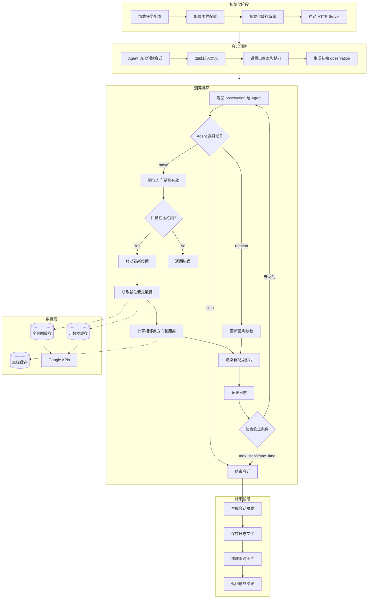
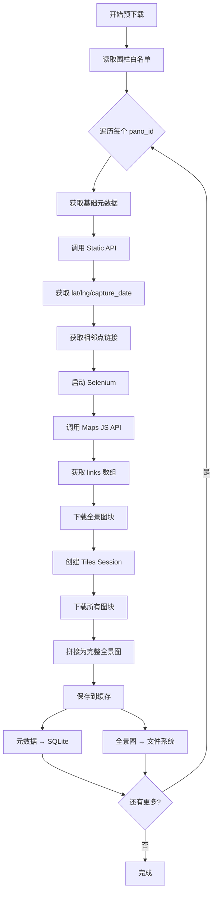

# VLN Benchmark 平台设计文档

## 一、项目概述

将现有的 Street View 全景浏览器升级为 **Vision-Language Navigation (VLN) Benchmark 平台**，用于测评 LLM/VLM 的视觉导航能力。

### 完整系统流程图



---

## 二、系统架构

```
┌──────────────────────────────────────────────────────────────┐
│                       VLN Benchmark 平台                      │
├──────────────────────────────────────────────────────────────┤
│  ┌────────────────────────────────────────────────────────┐  │
│  │                    Core Engine                          │  │
│  │  - 会话管理 (Session Manager)                           │  │
│  │  - 动作执行 (Action Executor)                           │  │
│  │  - 观测生成 (Observation Generator)                     │  │
│  │  - 日志记录 (Logger)                                    │  │
│  │  - 围栏检查 (Geofence Checker)                          │  │
│  └────────────────────────────────────────────────────────┘  │
│         │                              │                      │
│         ↓                              ↓                      │
│  ┌──────────────┐              ┌──────────────┐              │
│  │  HTTP API    │              │   Web UI     │              │
│  │  (FastAPI)   │              │  (全新开发)    │              │
│  │              │              │              │              │
│  │  供 Agent    │              │  供人类调试   │              │
│  │  程序调用    │              │  和可视化     │              │
│  └──────────────┘              └──────────────┘              │
│         │                              │                      │
├─────────┼──────────────────────────────┼──────────────────────┤
│         │      共享资源层              │                      │
│  ┌──────────────────────────────────────────────────────┐    │
│  │  - 全景图缓存 (panorama_cache/)                       │    │
│  │  - 元数据缓存 (_metadata_cache.json)                  │    │
│  │  - 坐标缓存 (_location_cache.json)                    │    │
│  │  - 围栏配置 (geofence_config.json)                    │    │
│  │  - 任务定义 (tasks/)                                  │    │
│  └──────────────────────────────────────────────────────┘    │
└──────────────────────────────────────────────────────────────┘
```

---

## 三、Google API 使用策略

> [!IMPORTANT]
> **核心设计原则：离线预处理 + 运行时只读**
> 
> - **离线阶段**：通过专门的预下载器，根据围栏配置**预先**抓取所有 Pano 的 Metadata (Links) 和 Images
> - **在线阶段**：Runtime Engine **严禁**发起任何 Google API 网络请求，**只读**本地缓存
> - **原因**：运行时调用 Selenium/API 存在严重的稳定性风险（反爬/超时/阻塞）
> - **数据追溯**：Metadata 中增加 `fetched_at` 和 `source` 字段，确保数据版本可追溯

> [!WARNING]
> **反爬注意事项**：Google 官方禁止批量存储，有反爬机制。预下载时需采用反爬策略：
> - 请求间隔：每次请求间添加随机延迟（如 1-3 秒）
> - 批量控制：单次预下载不宜过多，可分批进行
> - User-Agent 伪装：使用正常浏览器 UA
> - 错误重试：遇到 429/503 时指数退避重试

### 3.1 三种 API 概述

| API | 端点 | 用途 | 使用阶段 |
|-----|------|------|----------|
| **Tiles API** | tile.googleapis.com | 下载全景图块 | 离线预下载 |
| **Static API** | maps.googleapis.com/streetview/metadata | 获取坐标、拍摄时间 | 离线预下载 |
| **Maps JS API** | 通过 Selenium 调用 | 获取完整元数据（含相邻点 links） | 离线预下载 |

### 3.2 为什么需要三种 API

1. **Tiles API 的 metadata 端点**返回 400 错误（需要特定格式的 session）
2. **Static API 的 metadata**不包含 links（相邻点列表）
3. **只有 Maps JS API** 能获取完整的 links 信息

### 3.3 各 API 具体用法

**Tiles API - 下载图块**
- 创建 session：`POST /v1/createSession`（返回 token 和过期时间戳）
- 下载图块：`GET /v1/streetview/tiles/{z}/{x}/{y}?pano={pano_id}&session={token}`
- 计费：按图块请求数，$2.00/1000 请求，每月免费 100,000 请求
- Zoom 越高图块越多：zoom=2 需 8 张，zoom=3 需 32 张，zoom=4 需 128 张
- Session 用于认证，过期前自动刷新（建议提前 60 秒）

**Static API - 获取坐标和拍摄时间**
- 请求：`GET /maps/api/streetview/metadata?pano={pano_id}&key={key}`
- 返回：`{pano_id, location: {lat, lng}, date, status}`
- 速度快，适合批量获取坐标计算距离

**Maps JS API - 获取完整元数据**
- 通过 Selenium + headless Chrome 执行
- 调用：`StreetViewService.getPanorama({pano: pano_id})`
- 返回：pano_id、坐标、links（相邻点列表及其 heading）

### 3.4 图块网格规格

| Zoom | 横向图块 | 纵向图块 | 图片尺寸 |
|------|---------|---------|----------|
| 0 | 1 | 1 | 512×512 |
| 1 | 2 | 1 | 1024×512 |
| 2 | 4 | 2 | 2048×1024 |
| 3 | 8 | 4 | 4096×2048 |
| 4 | 16 | 8 | 8192×4096 |

计算公式：横向 = 2^zoom，纵向 = 2^(zoom-1)（zoom=0 时都为 1）

---

## 四、视角渲染

> [!NOTE]
> **渲染方案：服务端 Python Native + 客户端 Three.js**
> - **服务端**：使用 Python (OpenCV/Numpy/py360convert) 生成 Agent 观测图片
> - **客户端**：Web UI 使用 Three.js 进行交互式可视化/回放（利用客户端算力）

### 4.1 服务端渲染（Python）

使用 `py360convert` 进行 Equirectangular → Perspective 投影变换：

**输入参数**：
| 参数 | 说明 | 范围 |
|------|------|------|
| heading | 水平方位角 | 0-360° |
| pitch | 垂直俯仰角 | -85° ~ 85° |
| fov | 视野范围 | 30° ~ 100° |
| output_size | 输出分辨率 | 建议 1024×768 或 512×512 |

**渲染流程**：
```
1. 从缓存读取全景图 (equirectangular)
2. 调用 py360convert.e2p() 进行投影变换
3. 保存为 JPEG 到 temp_images/{session_id}/step_{n}.jpg
4. 返回图片路径或 base64
```

**依赖库**：
- `py360convert`：全景图投影变换
- `opencv-python`：图片读写
- `numpy`：矩阵运算

### 4.2 客户端渲染（Three.js）

用于 Web UI 的交互式全景查看和日志回放：

**全景球体**：
- 几何体：`THREE.SphereGeometry(500, 60, 40)`
- 材质：`THREE.MeshBasicMaterial({side: THREE.BackSide})`
- 相机：`THREE.PerspectiveCamera`，位于球心

**视角控制**：
- `lon`：0-360°（对应 heading）
- `lat`：-85° ~ 85°（对应 pitch）
- `fov`：30° ~ 100°
- 支持鼠标拖拽和滚轮缩放

### 4.3 双轨方案对比

| 场景 | 渲染方式 | 优势 |
|------|----------|------|
| Agent 测评 | 服务端 Python | 纯计算，无浏览器开销，可并行 |
| 人类调试/回放 | 客户端 Three.js | 交互流畅，利用客户端 GPU |

---

## 五、核心模块设计

### 5.1 会话管理 (Session Manager)

每个 Agent 运行一个独立会话：

| 字段 | 说明 |
|------|------|
| session_id | 唯一标识，格式：`{agent_id}_{task_id}_{timestamp}` |
| task | 任务定义 |
| current_state | 当前状态（位置、朝向、FOV 等）|
| step_count | 已执行步数 |
| start_time | 开始时间 |
| status | running / completed / timeout / stopped |
| logs | 日志列表 |

### 5.2 观测空间 (Observation)

每步返回给 Agent/Human 的信息：

```json
{
  "task_description": "Walk along this road and find the first traffic light",
  "current_image": "/temp_images/session_xxx/step_5.jpg",
  "panorama_url": "/data/panoramas/pano_id_z2.jpg",
  "available_moves": [
    {"id": 1, "direction": "front-left 15°", "distance": 10.5},
    {"id": 2, "direction": "front-right 30°", "distance": 8.2},
    {"id": 3, "direction": "left-back 20°", "distance": 12.1}
  ]
}
```

#### Agent 模式 vs Human 模式的图片传递差异

> [!IMPORTANT]
> **Agent 和 Human 看到的图片不同！**

| 模式 | 图片字段 | 图片类型 | 说明 |
|------|----------|----------|------|
| **Agent** | `current_image` | 透视视图 (1024×768) | 服务端渲染的固定视角，模拟人眼所见 |
| **Human** | `panorama_url` | 完整全景图 (2048×1024+) | 可拖拽交互式 360° 查看 |

**设计原理**：
- **Agent** 接收的是**固定视角的透视图**，模拟真实导航场景，不能"作弊"观察周围
- **Human** 接收的是**完整 360° 全景图**，可以自由拖拽查看，方便调试和录制

```
Agent Mode (透视图):           Human Mode (全景图):
┌─────────────────┐            ┌────────────────────────────┐
│                 │            │ ←  可拖拽查看 360°  →      │
│   FOV=90°视野   │            │                            │
│                 │            │   完整 equirectangular     │
│  Server 渲染    │            │   Three.js 交互渲染        │
└─────────────────┘            └────────────────────────────┘
    py360convert                     浏览器端 Three.js
```

**图片传输协议**：使用 **URL 模式**

| 对比项 | Base64 | URL (采用) |
|--------|--------|------------|
| 包体积 | 增加 ~33% | 原始大小 |
| CPU 开销 | 编解码消耗 | 无 |
| 日志回放 | 需重新解码 | 直接访问 |
| 前端调试 | 需额外处理 | 浏览器直接打开 |

> 对于本地 Benchmark，带宽不是瓶颈；URL 模式对日志回放和前端调试更友好。
> Agent 调用远程 LLM API 时，由 Agent 代码负责下载图片并转 Base64。

> 注：state、step、时间等信息仅用于内部日志记录，不发送给 Agent

### 5.3 动作空间 (Action)

Agent 可执行的动作：

**移动 (move)**
```json
{"type": "move", "move_id": 1}
```
- Agent 返回 `available_moves` 中对应的 `id` 值
- 系统根据 `move_id` 精确匹配，无需解析自然语言

**视角调整 (rotation)**
```json
{"type": "rotation", "heading": 45, "pitch": -10, "fov": 75}
```
- 使用绝对值
- heading: 0-360°
- pitch: -85° 到 85°
- fov: 30° 到 100°

**停止 (stop)**
```json
{"type": "stop", "answer": "The traffic light is 50 meters ahead at the intersection"}
```

### 5.4 方向计算逻辑

根据 Agent 当前朝向 (heading) 计算相邻点的相对方向：

```
relative_angle = (link_heading - agent_heading + 360) % 360

Four basic direction patterns:
┌─────────────────────────────────────────────────────────┐
│ Angle Range        │ Direction Description                 │
├─────────────────────────────────────────────────────────┤
│ 0°                  │ front                                 │
│ 0° < x < 90°        │ front-right X°                        │
│ 90°                 │ right                                 │
│ 90° < x < 180°      │ right-back (X-90)°                    │
│ 180°                │ back                                  │
│ 180° < x < 270°     │ left-back (270-X)°                    │
│ 270°                │ left                                  │
│ 270° < x < 360°     │ front-left (360-X)°                   │
└─────────────────────────────────────────────────────────┘
```

**Examples**:
- relative_angle 15° → `front-right 15°`
- relative_angle 90° → `right`
- relative_angle 120° → `right-back 30°`
- relative_angle 180° → `back`
- relative_angle 200° → `left-back 70°`
- relative_angle 270° → `left`
- relative_angle 330° → `front-left 30°`

---

## 六、HTTP API 设计

### 6.1 会话管理

**创建会话**
```
POST /api/session/create
Request:
{
  "agent_id": "gpt4v",
  "task_id": "task_001"
}
Response:
{
  "session_id": "gpt4v_task_001_20260109120000",
  "observation": { ... }
}
```

**获取状态**
```
GET /api/session/{session_id}/state
Response:
{
  "status": "running",
  "observation": { ... }
}
```

**结束会话**
```
POST /api/session/{session_id}/end
Response:
{
  "status": "completed",
  "total_steps": 23,
  "elapsed_time": 120.5,
  "log_path": "logs/session_xxx.jsonl"
}
```

### 6.2 动作执行

**执行动作**
```
POST /api/session/{session_id}/action
Request:
{
  "type": "move",
  "move_id": 1
}
Response:
{
  "success": true,
  "observation": { ... },
  "done": false,
  "done_reason": null
}
```

**done_reason 可能值**：
- `null` - 未结束
- `"stopped"` - Agent 主动停止
- `"max_steps"` - 超过最大步数
- `"max_time"` - 超过最大时间

### 6.3 任务管理

**获取任务列表**
```
GET /api/tasks
Response:
{
  "tasks": [
    {"task_id": "task_001", "description": "..."},
    {"task_id": "task_002", "description": "..."}
  ]
}
```

**获取任务详情**
```
GET /api/tasks/{task_id}
Response:
{
  "task_id": "task_001",
  "spawn_point": "pano_id_xxx",
  "spawn_heading": 0,
  "description": "找到最近的红绿灯并停在它前面",
  "answer": "",
  "target_pano_ids": ["pano_id_yyy"],
  "max_steps": 50,
  "max_time_seconds": 300
}
```

---

## 七、任务与围栏配置

### 7.1 任务定义文件

```
tasks/
├── task_001.json
├── task_002.json
└── ...
```

**task_001.json**：
```json
{
  "task_id": "task_001",
  "spawn_point": "wwkpfmLCWlQ0vinOvd0TpQ",
  "spawn_heading": 0,
  "description": "Walk along this road and find the first traffic light",
  "answer": "",
  "target_pano_ids": ["eHuvoWBH4_2L-Qv445p-Eg"],
  "max_steps": 50,
  "max_time_seconds": 300
}
```

**可选字段处理**：

| 字段 | 是否必填 | 缺失时的行为 |
|------|----------|-------------|
| task_id | ✅ 必填 | - |
| spawn_point | ✅ 必填 | - |
| spawn_heading | ✅ 必填 | - |
| description | ✅ 必填 | - |
| answer | 可选 | 默认为空字符串 |
| target_pano_ids | 可选 | 不自动判断是否到达目标 |
| max_steps | 可选 | 不限制步数，只能通过 stop 结束 |
| max_time_seconds | 可选 | 不限制时间，只能通过 stop 结束 |

**最简任务示例**（无限制）：
```json
{
  "task_id": "task_002",
  "spawn_point": "pano_id_xxx",
  "spawn_heading": 90,
  "description": "Explore this area and describe the buildings you see"
}
```

### 7.2 围栏配置文件

**geofence_config.json**：
```json
{
  "task_001": [
    "wwkpfmLCWlQ0vinOvd0TpQ",
    "eHuvoWBH4_2L-Qv445p-Eg",
    "JU3T888egwsVMxEFLLbgwg",
    "..."
  ],
  "task_002": [
    "pano_id_a",
    "pano_id_b",
    "..."
  ]
}
```

- 使用 pano_id 白名单形式
- 不在白名单中的点不会出现在 available_moves

---

## 八、全景图预下载系统

> [!IMPORTANT]
> **核心设计原则：离线预处理 + 运行时只读**
> 
> 运行时不发起任何 Google API 请求，所有数据必须提前下载到本地缓存。
> 这确保了测评过程的稳定性和可重复性。

### 8.1 预下载内容

预下载系统需要获取以下三类数据：

| 数据类型 | 来源 API | 存储位置 | 用途 |
|----------|----------|----------|------|
| **基础元数据** | Street View Static API | `cache.db` → metadata 表 | 坐标显示、距离计算 |
| **相邻点链接** | Maps JS API (Selenium) | `cache.db` → metadata 表 | 导航时获取可移动点 |
| **全景图片** | Tiles API | `data/panoramas/` | 视角渲染 |

### 8.2 预下载流程



### 8.3 数据获取详情

#### 8.3.1 基础元数据 (Static API)

**请求**：
```
GET https://maps.googleapis.com/maps/api/streetview/metadata
    ?pano={pano_id}
    &key={API_KEY}
```

**响应**：
```json
{
    "status": "OK",
    "pano_id": "wwkpfmLCWlQ0vinOvd0TpQ",
    "location": {
        "lat": 52.9497,
        "lng": -1.1906
    },
    "date": "2024-07"
}
```

#### 8.3.2 相邻点链接 (Maps JS API via Selenium)

由于相邻点 links 只能通过 Maps JavaScript API 获取，需要使用 Selenium 调用：

**Maps JS API 调用**：
```javascript
const sv = new google.maps.StreetViewService();
sv.getPanorama({pano: "{pano_id}"}, function(data, status) {
    if (status === "OK") {
        const links = data.links.map(link => ({
            panoId: link.pano,
            heading: link.heading,
            description: link.description
        }));
    }
});
```

**返回数据**：
```json
[
    {"panoId": "eHuvoWBH4_2L-Qv445p-Eg", "heading": 45.2, "description": ""},
    {"panoId": "JU3T888egwsVMxEFLLbgwg", "heading": 225.8, "description": ""}
]
```

#### 8.3.3 全景图块 (Tiles API)

**步骤**：
1. 创建 Tiles Session（有效期 24 小时）
2. 根据 zoom level 计算图块数量
3. 下载所有图块并拼接

**图块尺寸**：

| Zoom | 图块数 (宽×高) | 最终尺寸 |
|------|---------------|----------|
| 0 | 1×1 | 512×512 |
| 1 | 2×1 | 1024×512 |
| 2 | 4×2 | 2048×1024 |
| 3 | 8×4 | 4096×2048 |
| 4 | 16×8 | 8192×4096 |
| 5 | 32×16 | 16384×8192 |

### 8.4 预下载触发方式

系统提供两种触发方式：

#### 8.4.1 Web UI 界面

通过主页的 **📥 Preload Data** 按钮：
- 支持勾选要下载的任务
- 支持选择 Zoom Level
- 支持一键下载全部任务
- 实时显示下载进度

#### 8.4.2 HTTP API

```
POST /api/tasks/{task_id}/preload
Body: {"zoom_level": 2}

Response:
{
    "status": "started",
    "progress": 0,
    "total": 10,
    "percentage": 0.0,
    "message": "Preloading 10 panoramas at zoom level 2"
}
```

**查询进度**：
```
GET /api/tasks/{task_id}/preload/status

Response:
{
    "status": "in_progress",
    "progress": 5,
    "total": 10,
    "percentage": 50.0
}
```

### 8.5 缓存存储结构

```
data/
├── cache.db              # SQLite 数据库
│   ├── panoramas         # 全景图索引
│   ├── metadata          # 元数据（含 links）
│   └── locations         # 坐标快速查询
└── panoramas/
    ├── {pano_id}_z1.jpg
    ├── {pano_id}_z2.jpg
    └── ...
```

### 8.6 反爬策略

预下载过程需要遵守以下反爬措施：

| 策略 | 实现 |
|------|------|
| 请求间隔 | 每个请求间随机延迟 1-3 秒 |
| 重试机制 | 失败后指数退避重试，最多 3 次 |
| Session 复用 | Tiles API Session 复用，减少请求 |
| 批量控制 | 可配置并行 worker 数量 |

### 8.7 配置项

```python
# 预下载相关配置 (config/settings.py)
PANORAMA_ZOOM_LEVEL = 2           # 默认图片质量
PREFETCH_REQUEST_DELAY_MIN = 1.0  # 最小请求间隔
PREFETCH_REQUEST_DELAY_MAX = 3.0  # 最大请求间隔
PREFETCH_RETRY_MAX = 3            # 最大重试次数
PREFETCH_PARALLEL_WORKERS = 4     # 并行下载数
```

---

## 九、日志格式

### 8.1 日志文件

```
logs/
├── gpt4v_task_001_20260109120000.jsonl
├── claude_task_002_20260109130000.jsonl
└── ...
```

使用 JSON Lines 格式，每行一条记录。

### 8.2 日志条目

```json
{
  "session_id": "gpt4v_task_001_20260109120000",
  "timestamp": "2026-01-09T12:00:05.123",
  "step": 5,
  "state": {
    "pano_id": "wwkpfmLCWlQ0vinOvd0TpQ",
    "capture_date": "2016-05",
    "lat": 52.9497,
    "lng": -1.1906,
    "heading": 45,
    "pitch": -10,
    "fov": 75
  },
  "action": {
    "type": "move",
    "move_id": 1,
    "direction": "front-left 15°",
    "target_pano_id": "eHuvoWBH4_2L-Qv445p-Eg"
  },
  "available_moves": [
    {"id": 1, "direction": "front-left 15°", "distance": 10.5},
    {"id": 2, "direction": "front-right 30°", "distance": 8.2}
  ],
  "image_path": "temp_images/gpt4v_task_001_20260109120000/step_5.jpg"
}
```

> 注：每个会话有独立的图片文件夹：`temp_images/{session_id}/`

### 8.3 会话摘要日志

每个会话结束时生成摘要：

```json
{
  "session_id": "gpt4v_task_001_20260109120000",
  "agent_id": "gpt4v",
  "task_id": "task_001",
  "start_time": "2026-01-09T12:00:00",
  "end_time": "2026-01-09T12:02:30",
  "total_steps": 23,
  "elapsed_time": 150.5,
  "status": "completed",
  "done_reason": "stopped",
  "final_pano_id": "eHuvoWBH4_2L-Qv445p-Eg",
  "reached_target": true,
  "agent_answer": "The traffic light is at the intersection ahead",
  "trajectory": ["pano_1", "pano_2", "pano_3", "..."]
}
```

---

## 九、并行测评

### 9.1 架构设计

```
主进程 (FastAPI)
    │
    ├─ Session 1 (Agent A, Task 1) ─── 独立状态
    ├─ Session 2 (Agent B, Task 2) ─── 独立状态
    └─ Session 3 (Agent A, Task 3) ─── 独立状态
          │
          └─── 共享：全景缓存、元数据缓存、坐标缓存
```

### 9.2 共享与隔离

| 资源 | 共享/隔离 |
|------|----------|
| 全景图片缓存 | 共享 |
| 元数据缓存 | 共享 |
| 坐标缓存 | 共享 |
| Session 状态 | 隔离 |
| 日志文件 | 隔离 |
| 临时图片 | 隔离（用后可删） |

### 9.3 临时图片管理

**存储结构**：
```
temp_images/
├── gpt4v_task_001_20260109120000/
│   ├── step_1.jpg
│   ├── step_2.jpg
│   └── ...
├── claude_task_002_20260109130000/
│   ├── step_1.jpg
│   └── ...
└── ...
```

**生命周期**：
1. **创建**：每次生成观测时渲染并保存到 `temp_images/{session_id}/step_{n}.jpg`
2. **发送**：通过 base64 或 URL 返回给 Agent
3. **记录**：日志中保留路径用于回放调试
4. **清理**：提供以下清理策略

**清理策略**（可配置）：

| 策略 | 说明 |
|------|------|
| `keep_all` | 保留所有图片（用于调试）|
| `keep_on_complete` | 仅在会话正常结束时保留 |
| `delete_on_send` | 发送给 Agent 后立即删除 |
| `delete_on_session_end` | 会话结束时删除整个文件夹 |
| `auto_expire` | 超过 N 小时自动删除 |

**默认策略**：`delete_on_session_end`（会话结束时删除，节省空间）

---

## 十、可视化设计

### 10.1 2D 地图轨迹

使用 Leaflet.js 在 Web UI 中显示：

- 底图：OpenStreetMap 或其他
- 标记：出生点（绿色）、当前位置（蓝色）、目标点（红色）
- 轨迹：连接各步位置的折线
- 方向：每个点显示 Agent 朝向箭头

### 10.2 日志回放

- 选择历史会话
- 按步骤回放
- 同时显示当时的视角图和地图位置

---

## 十一、文件结构

```
vln_benchmark/
├── main.py                      # FastAPI 主程序
├── engine/
│   ├── session_manager.py       # 会话管理
│   ├── action_executor.py       # 动作执行
│   ├── observation_generator.py # 观测生成
│   ├── geofence_checker.py      # 围栏检查
│   ├── direction_calculator.py  # 方向计算
│   ├── tiles_downloader.py      # 图块下载（全新实现）
│   └── image_stitcher.py        # 图块拼接（全新实现）
├── api/
│   ├── routes.py                # API 路由
│   └── models.py                # 请求/响应模型
├── cache/                       # 缓存模块（全新实现）
│   ├── cache_manager.py         # 缓存管理器
│   ├── panorama_cache.py        # 全景图缓存
│   └── metadata_cache.py        # 元数据缓存
├── config/
│   ├── geofence_config.json     # 围栏配置
│   └── settings.py              # 全局设置
├── tasks/
│   ├── task_001.json
│   └── ...
├── logs/
│   └── {session_id}.jsonl
├── temp_images/
│   └── {session_id}/
├── data/                        # 缓存数据存储
│   ├── cache.db                 # SQLite 数据库（元数据/坐标）
│   └── panoramas/               # 全景图片 {pano_id}_z{level}.jpg
└── web_ui/                      # 前端 UI（全新开发）
    ├── index.html               # 主页面（调试用）
    ├── human_eval.html          # 人类评测页面
    ├── visualizer.html          # 轨迹可视化/回放
    ├── css/
    │   └── style.css
    └── js/
        ├── panorama_viewer.js   # 全景渲染 (Three.js)
        ├── map_view.js          # 地图视图 (Leaflet)
        └── api_client.js        # API 调用
```

---

## 十二、配置管理

### 12.1 配置文件结构

```
config/
├── settings.py              # 全局设置（Python）
├── geofence_config.json     # 围栏配置
└── .env                     # 环境变量（不提交到 Git）
```

### 12.2 环境变量 (.env)

```bash
# Google API Keys (离线预下载阶段使用)
GOOGLE_API_KEY=your_api_key_here

# 可选：多 key 轮换（应对反爬限制，逗号分隔）
# GOOGLE_API_KEYS=key1,key2,key3
```

> [!CAUTION]
> **安全提醒**：`.env` 文件必须添加到 `.gitignore`，禁止提交到版本控制。

### 12.3 全局设置 (settings.py)

```python
import os
from dotenv import load_dotenv

load_dotenv()

class Settings:
    # === Google API ===
    GOOGLE_API_KEY: str = os.getenv("GOOGLE_API_KEY", "")
    GOOGLE_API_KEYS: list = os.getenv("GOOGLE_API_KEYS", "").split(",")
    
    # === 全景图质量 ===
    # Zoom 级别：0-5，数值越大分辨率越高
    # | Zoom | 图片尺寸     | 推荐用途           |
    # |------|--------------|--------------------|
    # | 0    | 512×512      | 极速调试           |
    # | 1    | 1024×512     | 开发调试           |
    # | 2    | 2048×1024    | 开发调试           |
    # | 3    | 4096×2048    | Benchmark 推荐     |
    # | 4    | 8192×4096    | 高精度测试         |
    # | 5    | 16384×8192   | 最高质量（慎用）   |
    PANORAMA_ZOOM_LEVEL: int = 2  # 开发阶段默认 2，正式 Benchmark 设为 3
    
    # === 临时图片管理 ===
    # 策略：keep_all / keep_on_complete / delete_on_send / 
    #       delete_on_session_end / auto_expire
    TEMP_IMAGE_CLEANUP_POLICY: str = "delete_on_session_end"
    TEMP_IMAGE_EXPIRE_HOURS: int = 24  # auto_expire 模式下的过期时间
    
    # === 服务端渲染 ===
    RENDER_OUTPUT_SIZE: tuple = (1024, 768)  # Agent 观测图尺寸
    RENDER_DEFAULT_FOV: int = 90             # 默认视野范围
    
    # === 预下载 ===
    PREFETCH_REQUEST_DELAY_MIN: float = 1.0  # 请求间隔最小秒数
    PREFETCH_REQUEST_DELAY_MAX: float = 3.0  # 请求间隔最大秒数
    PREFETCH_RETRY_MAX: int = 3              # 最大重试次数
    PREFETCH_RETRY_BACKOFF: float = 2.0      # 指数退避系数

settings = Settings()
```

### 12.4 配置优先级

1. **环境变量** (`.env`) — 最高优先级，用于敏感信息
2. **settings.py** — 默认值和非敏感配置
3. **任务文件** (`tasks/*.json`) — 任务级覆盖（如特定任务使用更高 zoom）

---

## 十三、缓存系统设计

> [!IMPORTANT]
> **并发安全：使用 SQLite 替代 JSON 文件**
> - 原方案（JSON 覆写）在多进程/多线程下会导致数据丢失或文件损坏
> - SQLite 支持 WAL 模式，提供 ACID 保证，原生支持并发读写
> - Python 内置 `sqlite3`，零额外依赖

### 13.1 缓存架构

```
data/
├── cache.db              # SQLite 数据库（统一存储）
└── panoramas/            # 全景图片文件
    ├── {pano_id}_z0.jpg
    ├── {pano_id}_z1.jpg
    └── ...
```

**数据库表结构**：
```sql
-- 全景图索引表
CREATE TABLE panoramas (
    pano_id TEXT NOT NULL,
    zoom INTEGER NOT NULL,
    image_path TEXT NOT NULL,
    fetched_at TIMESTAMP DEFAULT CURRENT_TIMESTAMP,
    PRIMARY KEY (pano_id, zoom)
);

-- 元数据表
CREATE TABLE metadata (
    pano_id TEXT PRIMARY KEY,
    lat REAL NOT NULL,
    lng REAL NOT NULL,
    capture_date TEXT,
    links TEXT,  -- JSON 格式存储
    fetched_at TIMESTAMP DEFAULT CURRENT_TIMESTAMP,
    source TEXT  -- 'maps_js_api' | 'static_api'
);

-- 坐标表（冗余，用于快速查询）
CREATE TABLE locations (
    pano_id TEXT PRIMARY KEY,
    lat REAL NOT NULL,
    lng REAL NOT NULL
);
```

### 13.2 全景图片缓存 (PanoramaCache)

**存储路径**：`data/panoramas/{pano_id}_z{level}.jpg`

**数据库索引**：`panoramas` 表记录图片路径

**功能**：
- `has(pano_id, zoom)` → 查询数据库是否存在
- `get(pano_id, zoom)` → 返回图片路径
- `save(pano_id, zoom, image)` → 保存图片并插入记录

### 13.3 元数据缓存 (MetadataCache)

**存储表**：`metadata`

**links 字段格式**（JSON 字符串）：
```json
[
  {"panoId": "pano_id_2", "heading": 356},
  {"panoId": "pano_id_3", "heading": 175}
]
```

**功能**：
- `has(pano_id)` → 检查是否存在
- `get(pano_id)` → 返回元数据字典
- `save(pano_id, metadata)` → 插入或更新

> `fetched_at` 和 `source` 用于数据版本追溯，确保可复现性

### 13.4 坐标缓存 (LocationCache)

**存储表**：`locations`

**用途**：计算距离时快速获取坐标

**功能**：
- `get(pano_id)` → 返回 `(lat, lng)` 元组
- `save(pano_id, lat, lng)` → 插入或更新

### 13.5 SQLite 配置

**推荐配置**（提升并发性能）：
```python
conn = sqlite3.connect('data/cache.db')
conn.execute('PRAGMA journal_mode=WAL')      # 启用 WAL 模式
conn.execute('PRAGMA synchronous=NORMAL')    # 平衡性能和安全
conn.execute('PRAGMA cache_size=-64000')     # 64MB 缓存
```

### 13.6 任务预下载

在任务开始前，根据围栏配置**预先下载所有全景图和元数据**：

**预下载流程**：
```
1. 读取 geofence_config.json 获取该任务的 pano_id 白名单
2. 查重：检查每个 pano_id 是否已有缓存
   - 全景图：检查 data/panoramas/{pano_id}_z{level}.jpg 是否存在
   - 元数据：检查 metadata_cache 中是否有该 pano_id
   - 坐标：检查 location_cache 中是否有该 pano_id
3. 仅下载缺失的数据，跳过已存在的
4. 预下载完成后，任务准备就绪
```

**配置选项**：

| 配置项 | 说明 | 默认值 |
|--------|------|--------|
| `preload_zoom_level` | 预下载的缩放级别 | 2 |
| `preload_on_startup` | 启动时自动预下载所有任务 | false |
| `preload_parallel` | 并行下载线程数 | 4 |

**预下载 API**：
```
POST /api/tasks/{task_id}/preload
Request:
{
  "zoom_level": 2  // 可选，默认使用配置值
}
Response:
{
  "status": "started",
  "total": 50,
  "message": "Preloading 50 panoramas at zoom level 2"
}

GET /api/tasks/{task_id}/preload/status
Response:
{
  "status": "in_progress",  // pending | in_progress | completed | failed
  "progress": 35,
  "total": 50,
  "percentage": 70
}
```

**注意事项**：
- 任务首次运行前应先完成预下载，否则会导致运行时下载延迟
- 不同 zoom level 的图片独立存储，可按需预下载多个级别
- 预下载进度可通过 API 查询

---

## 十四、Web UI 设计

### 14.1 页面结构

> [!NOTE]
> Web UI 分为两类：**Agent 日志回放**（无实时交互）和 **人类选手评测**（实时交互）。

**agent_replay.html** - Agent 日志回放页面：
- 选择历史会话（按 agent_id/task_id 筛选）
- 2D 地图显示完整轨迹
- 可选：步骤播放器（前进/后退/自动播放）

**human_eval.html** - 人类选手评测页面：

```
┌──────────────────────────────────────────────────────────┐
│ 选手: xxx    进度: 23/50    任务: task_024               │
├────────────────────────────────────────────┬─────────────┤
│                                            │   任务描述   │
│         全景图查看器                         │   "找到..."  │
│         (鼠标拖拽调整视角)                   ├─────────────┤
│                                            │   统计信息   │
│                                            │   步数/时间  │
├────────────────────────────────────────────┴─────────────┤
│ 可用移动: [1] 前方偏左15° [2] 前方偏右30°                 │
├──────────────────────────────────────────────────────────┤
│ 答案: [___________________________] [Stop]               │
└──────────────────────────────────────────────────────────┘
```

**说明**：
- 全景查看器：鼠标拖拽调整视角（无独立视角控制按钮）
- 答案文本框：用于简答题（可选填写）
- 人类选手只有 `move` 和 `stop` 两种动作

### 14.2 前端组件

**panorama_viewer.js**：
- Three.js 全景球体渲染
- 鼠标拖拽视角控制
- 滚轮缩放 FOV
- 纹理加载与切换

**map_view.js**：
- Leaflet 地图初始化
- 标记点添加/移除
- 轨迹线绘制
- 方向箭头显示

**api_client.js**：
- 封装 HTTP API 调用
- 会话管理
- 动作发送
- 观测处理

### 14.3 UI 工作流程

```
1. 选择任务 → 调用 POST /api/session/create
2. 收到初始 observation
3. 显示全景图 + 地图位置 + 可用操作
4. 用户点击操作 → POST /api/session/{id}/action
5. 更新显示
6. 重复 4-5 直到 done=true
```

### 14.4 人类评测模式

> [!IMPORTANT]
> Web UI 不仅用于调试和回放，还支持**人类选手的正式评测**，与 LLM Agent 使用相同的日志格式和评分标准。

#### 14.4.1 功能概述

| 功能 | 说明 |
|------|------|
| 局域网访问 | 支持多台设备通过局域网 IP 访问评测界面 |
| 统一日志 | 人类与机器生成相同格式的日志，便于对比分析 |
| 中断恢复 | 支持从断点继续评测，不丢失已完成进度 |
| 进度追踪 | 实时显示已完成/未完成任务列表 |

#### 14.4.2 人类评测会话

**创建人类会话**：
```
POST /api/session/create
Request:
{
  "agent_id": "human_player_001",    // 人类选手 ID
  "task_id": "task_001",
  "mode": "human"                     // 标记为人类评测模式
}
```

**会话状态扩展**：
```json
{
  "session_id": "human_player_001_task_001_20260112120000",
  "mode": "human",
  "status": "running",           // running / paused / completed
  "step_count": 15,
  "elapsed_time": 180.5,
  "last_active": "2026-01-12T12:03:00"
}
```

#### 14.4.3 中断与恢复机制

**自动保存**：
- 每个动作执行后自动保存会话状态到数据库
- 保存内容：当前位置、朝向、步数、已用时间、轨迹

**恢复会话 API**：
```
POST /api/session/{session_id}/resume
Response:
{
  "success": true,
  "observation": { ... },           // 恢复时的观测
  "restored_state": {
    "step_count": 15,
    "elapsed_time": 180.5,
    "trajectory_length": 15
  }
}
```

**暂停会话 API**：
```
POST /api/session/{session_id}/pause
Response:
{
  "success": true,
  "status": "paused",
  "can_resume": true
}
```

#### 14.4.4 评测进度管理

**选手进度表**（数据库）：
```sql
CREATE TABLE player_progress (
    player_id TEXT NOT NULL,
    task_id TEXT NOT NULL,
    session_id TEXT,
    status TEXT DEFAULT 'not_started',  -- not_started / in_progress / completed
    score REAL,
    attempts INTEGER DEFAULT 0,
    last_attempt_at TIMESTAMP,
    PRIMARY KEY (player_id, task_id)
);
```

**获取选手进度 API**：
```
GET /api/players/{player_id}/progress
Response:
{
  "player_id": "human_player_001",
  "total_tasks": 50,
  "completed": 23,
  "in_progress": 1,
  "not_started": 26,
  "tasks": [
    {"task_id": "task_001", "status": "completed", "score": 0.85},
    {"task_id": "task_002", "status": "in_progress", "session_id": "xxx"},
    {"task_id": "task_003", "status": "not_started"}
  ]
}
```

#### 14.4.5 人类选手动作类型

| 动作 | 说明 |
|------|------|
| `move` | 选择移动方向（点击按钮/按数字键） |
| `stop` | 结束任务并提交答案（含可选的文本答案） |

> [!NOTE]
> 人类选手无 `rotation` 动作。视角通过鼠标拖拽调整，仅在 `move`/`stop` 时记录当时的视角状态。

**人类日志示例**：
```json
{
  "step": 5,
  "agent_type": "human",
  "action": {"type": "move", "move_id": 1},
  "view_state_at_action": {"heading": 45, "pitch": -10, "fov": 90},
  "response_time_ms": 5000
}
```

#### 14.4.6 局域网部署

**服务器启动**：
```bash
# 允许局域网访问
uvicorn main:app --host 0.0.0.0 --port 8000
```

**访问方式**：
- 本机：`http://localhost:8000/human_eval.html`
- 局域网：`http://192.168.x.x:8000/human_eval.html`

**多选手并发**：
- 每个选手使用独立的 `player_id`
- 各选手会话完全隔离
- 共享只读的全景图缓存

#### 14.4.7 日志格式（与 LLM Agent 统一）

人类评测生成的日志与 LLM Agent 格式完全一致：

```json
{
  "session_id": "human_player_001_task_001_20260112120000",
  "timestamp": "2026-01-12T12:03:05.123",
  "step": 15,
  "agent_type": "human",           // 标记为人类
  "state": { ... },
  "action": {
    "type": "move",
    "move_id": 2,
    "direction": "front-right 30°",
    "target_pano_id": "xxx",
    "input_method": "click"        // click / keyboard / touch
  },
  "response_time_ms": 2500,        // 人类反应时间（毫秒）
  "available_moves": [ ... ],
  "image_path": "temp_images/xxx/step_15.jpg"
}
```

> 通过 `agent_type` 字段区分人类与机器日志，便于后续对比分析。

---

## 十五、LLM Agent 集成

### 15.1 Agent 类设计

每个 LLM（如 GPT-4V、Gemini）封装为一个 Agent 类：

| 方法 | 功能 |
|------|------|
| `get_action(observation)` | 根据观测返回动作 |
| `build_prompt(observation)` | 构造发送给 LLM 的 prompt |
| `call_api(prompt, image)` | 调用 LLM API |
| `parse_response(response)` | 解析 LLM 返回的动作 |

### 15.2 Prompt 设计

发送给 LLM 的 prompt 包含：
1. **系统角色**：告诉 LLM 它是一个导航 Agent
2. **任务描述**：来自 `observation.task_description`
3. **当前视角图**：作为图片输入
4. **可用动作**：格式化的 `available_moves` 列表
5. **输出格式要求**：要求返回 JSON 格式的动作

### 15.3 测评循环

```
1. 创建会话 → 获取初始 observation
2. 构造 prompt（任务 + 图片 + 可用动作）
3. 调用 LLM API → 获取动作
4. 发送动作到平台 → 获取新 observation
5. 重复 2-4 直到 done=true
6. 记录结果
```

### 15.4 支持的 LLM

| LLM | API | 特点 |
|-----|-----|------|
| GPT-4V | OpenAI API | 支持图片输入 |
| GPT-4o | OpenAI API | 更快，成本更低 |
| Gemini Pro Vision | Google API | 支持图片输入 |
| Claude 3 | Anthropic API | 支持图片输入 |

### 15.5 批量测评

支持批量运行多个 Task：
1. 加载任务列表
2. 为每个任务创建会话
3. 运行测评循环
4. 收集所有结果
5. 生成评测报告

---

## 十六、开发计划

### 阶段 1：基础设施
- [ ] 初始化项目结构
- [ ] 实现图块下载器 (tiles_downloader.py)
- [ ] 实现图块拼接器 (image_stitcher.py)
- [ ] 实现缓存系统 (cache/)

### 阶段 2：核心引擎
- [ ] 实现 Session Manager
- [ ] 实现方向计算逻辑
- [ ] 实现围栏检查
- [ ] 实现观测生成器

### 阶段 3：HTTP API
- [ ] 搭建 FastAPI 框架
- [ ] 实现会话相关 API
- [ ] 实现动作执行 API
- [ ] 实现任务管理 API

### 阶段 4：日志与配置
- [ ] 实现日志记录
- [ ] 实现任务/围栏配置加载
- [ ] 实现会话摘要生成

### 阶段 5：Web UI
- [ ] 实现全景查看器 (Three.js)
- [ ] 实现 2D 地图 (Leaflet)
- [ ] 实现控制面板
- [ ] 实现轨迹可视化/回放

### 阶段 6：并行与优化
- [ ] 支持多会话并行
- [ ] 临时图片管理
- [ ] 性能优化
