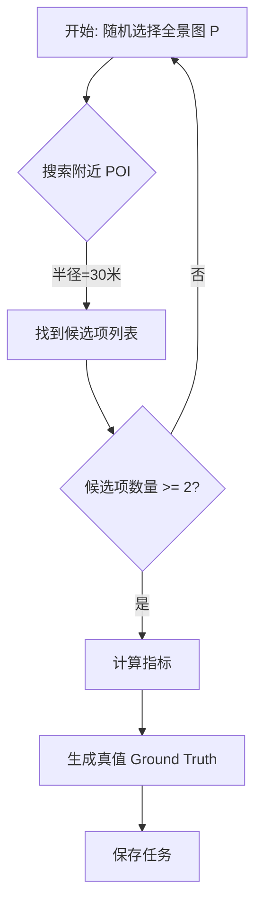

# 空间方位判断与距离估计任务设计方案

## 1. 概述
本文档概述了一种新的**空间推理 (Spatial Reasoning)** 任务类型的设计方案。该任务旨在评估 Agent 在静态街景视角下，估计可见 POI（兴趣点）的相对方位和距离的能力。

**任务场景**：Agent 位于某个特定的全景图 (Panorama) 位置。附近有两个或以上的 POI（例如一家麦当劳和一家星巴克）。Agent 需要回答关于它们相对位置（方位/方向）和距离的问题。

## 2. 可行性分析
代码库中已具备支持该任务的技术基础：
- **精确坐标**：
  - `POI` 对象包含来自 Google Places API 的精确 `lat`/`lng`（经纬度）。
  - `Panorama` 对象包含来自 Street View Metadata 的 `lat`/`lng`。
- **数学工具**：
  - `TaskAssembler` 中已包含距离计算功能（`Haversine Formula`）。
  - 方位计算功能（`Rhumb line` 或 `Great Circle` bearing）也已实现。

**结论**：我们可以通过数学方法高精度地计算出距离和方位的“真值 (Ground Truth)”。

## 3. 核心难点与应对策略
在实际应用中存在两个主要挑战：

### A. 可见性 (Occlusion)
*问题*：数学上的可见并不等于视觉上的可见。即使 POI 距离只有 20 米，也可能被建筑物阻挡。
*解决方案*：
- **近距离过滤**：严格限制任务生成，只选择距离全景图极近（例如 < 20-30米）的 POI。
- **同路判断 (地址匹配)**：检查 POI 的地址文本，提取街道名称。只有当两个 POI 的街道名称完全一致（例如都包含 "Main St"）时，才认为它们在同一条路上。这能极大降低 POI 位于 Building Block 背后的风险。
- **视线检查 (启发式)**：结合“同路判断”，如果两个 POI 在同一条路上，且距离 Agent 很近，通常意味着它们都在视线范围内（Agent 位于街道上）。
- **Prompt 优化**：指示 Agent “根据地图知识推断位置”，如果视觉线索模糊的话。

### B. 坐标精度
*问题*：Places API 返回的坐标通常是建筑物的几何中心，而非正门位置。
*解决方案*：
- **精确评估 (带容错)**：虽然存在中心点误差，但我们要求 Agent 给出精确的数值估算，通过设定合理的容错范围来覆盖误差。
  - **距离**：要求输出精确米数，允许 $\pm 20\%$ 误差。
  - **方向**：要求输出精确角度 (0-360°)，允许 $\pm 30^{\circ}$ 误差。

## 4. 任务生成逻辑 (算法)
`generate_spatial_tasks.py` 的建议逻辑：

### 步骤详解：
1.  **锚点选择 (Global Sampling)**：
    *   **策略**：从预定义的全球主要城市列表中（或随机生成坐标），选择一个中心点。
    *   **随机漫步**：在中心点附近随机选择一个全景图 $P$ 作为起始搜索点。
2.  **双目标搜索**：
    - 以 $P$ 的坐标为中心执行 `Nearby Search`（周边搜索）。
    - 半径：**严格限制在 30 米内**（以最大化可见性）。
    - 限制类别为高辨识度类型（餐厅、银行、加油站）。
3.  **候选项过滤**：
    - 结果中必须识别出至少两个不同的 POI（$A$ 和 $B$）。
    - **同路检查**：提取 $A$ 和 $B$ 的 `formattedAddress`，比对街道名称是否一致。如果不一致（例如一个是 Main St，另一个是 5th Ave），则舍弃或标记为“转角可见”。建议初期只保留“同路”的任务。
4.  **真值计算**：
    - **距离**：$D_A = \text{dist}(P, A)$，$D_B = \text{dist}(P, B)$。
    - **绝对方位**：$\theta_A = \text{heading}(P \to A)$，$\theta_B = \text{heading}(P \to B)$。
    - **相对方位**：假设 Agent 面向 $A$，计算 $B$ 相对于 $A$ 的“时钟位置”，或直接计算相对于正北的方向。
5.  **任务构建**：
    - 构建 Prompt：*“你当前位于坐标 X。附近有一家麦当劳和一家星巴克。请估计到它们的距离以及它们的相对方向。”*
    - 存储有效的真值范围。

## 5. 白名单范围定义 (Whitelist / Geofence)
根据新的需求，白名单的定义调整为 **路径连通型白名单 (Connected Path Whitelist)**。

*   **定义**：白名单包含两个目标 POI 所在的全景图，连接它们的最短路径，**以及这两个端点全景图的所有相邻节点 (Neighbors)**。
    *   **扩展白名单**：$Whitelist = \{P_A\} \cup \{P_B\} \cup Path(P_A, P_B) \cup Neighbors(P_A) \cup Neighbors(P_B)$。
    *   **目的**：确保 Agent 在起点有“移动”的选项（Available Moves），即使它只需要原地观察。
    *   **过滤孤岛**：生成时必须检查 $P_A$ 和 $P_B$。如果它们所在的 Panorama 没有 `links`（即孤立点，无法移动），则**直接舍弃**该任务。必须确保 Agent 处于一个可连通的街景网络中。

*   **搜索范围 (Search Scope)**：
    *   **全球范围 (Global Search)**：不再局限于某个预设的小区域或白名单。
    *   **生成策略**：
        1.  在世界各地的主要城市中随机采样坐标。
        2.  搜索附近的 POI 对 ($POIs_{candidate}$)。
        3.  验证连通性：检查这两个 POI 对应的最近全景图 $P_A$ 和 $P_B$ 是否在街景图中**紧密连通** ($Steps \le 3$)。
        4.  **孤点检查**：检查 $P_A$ 和 $P_B$ 是否有有效的 `links`。如果没有连接（孤点），则丢弃。
        5.  如果连通且非孤点，则提取路径及两端邻居构建白名单。

*   **Agent 初始位置**：Agent 可以被放置在路径上的任意一点。

## 6. 评估指标 (Evaluation)
测评采用**精确值比对**，但允许一定的容错范围（Evaluation Code 层面的逻辑，生成时只需记录精确真值）。

- **距离评估 (Distance)**：
    - **要求**：输出精确数值（例如 "25 meters"）。
    - **容错**：允许 $\pm 20\%$ 的误差。
    - *Example*: 真值 20m，Agent 输出 16m-24m 均判为正确。

- **方向评估 (Orientation/Bearing)**：
    - **要求**：输出精确的角度值或方位描述（例如 "310°" 或 "310° NW"）。
    - **容错**：允许 $\pm 30^{\circ}$ 的误差。
    - *Example*: 真值 310°，Agent 输出 280°-340° 均判为正确。

## 7. 任务生成与存储 (Pipeline & Storage)
*   **存储路径**：新建专门的文件夹 `tasks_spatial_orientation/` 专门用于存储此类任务的数据。
